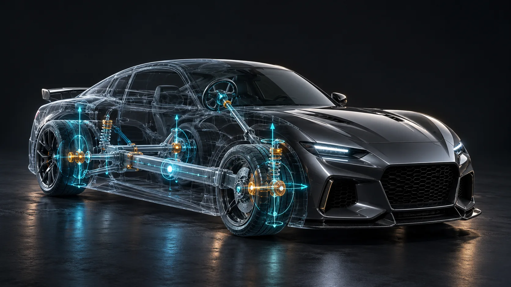

# BDFR Advanced AutoRig



**Automatic first-pass vehicle rigging for Blender 4.2+.** Select a vehicle, inspect detected parts, and build an armature with rigid weights and simple animation controls.

> **Status:** v0.5.0 preview. Detection uses object names, disconnected mesh islands, dimensions and position. It is heuristic geometry analysis, not machine-learning segmentation. Blender runtime validation on representative production files is still pending.

[راهنمای فارسی](docs/README.fa.md) · [Installable add-on ZIP](https://github.com/lyingtiger88/BDFR_AdvancedAutoRig/releases/download/v0.5.0/BDFR_AdvancedAutoRig-0.5.0.zip)

## What it does

- Supports **car/SUV, truck/bus, motorcycle and bicycle** layouts; set the model's front axis to `±X` or `±Y` (`Z` up).
- **Analyze Vehicle** places a labeled FRONT arrow above the front edge in the 3D viewport. Changing the axis or sign moves and turns it. **Show FRONT Arrow** toggles visibility; the arrow is excluded from renders and follows the rig after **Build Rig**. For an older rig, select it and click **Show FRONT Arrow** in the rig panel to add the indicator.
- Finds wheels from component names or shape and location, scans disconnected mesh islands, and merges concentric tire/rim/hub components into one wheel control.
- Lets you review each detected component and correct its type. Separate mesh objects can also be explicitly marked as body, wheel, door, hood, trunk or ignored.
- **Simple** creates `Root`, `Body`, wheels and steering controls. Doors and hatches stay rigid with the body. **Advanced** adds one or more poseable suspension bones per wheel, plus optional door, hood and trunk hinges. Each component receives a rigid vertex group and an Armature modifier; source mesh geometry is not split.
- In Advanced mode, **Bone Count** sets a target total of 2–128 bones. The panel shows the minimum and actual count after analysis. Required controls are never discarded; extra bones extend the wheel suspension chains. The value is saved into each newly built rig.
- Parents the selected vehicle hierarchy to the armature object while preserving world transforms, so moving `Vehicle_Rig` in Object Mode carries the meshes. Shows mesh-binding status on the selected rig and provides repair and explicit selected-mesh binding.
- Labels front and rear wheels after analysis and lets you correct each wheel's axle with **Front / Rear**. Steering remains keyframeable; wheel rotation is keyed directly on wheel bones, with no Roll slider.
- The **Test Rig Functionality** section creates and plays a 73-frame preview: detected doors, hood and trunk open and close, and the wheels rotate. The Remove button deletes the preview and restores the previous timeline and pose.

## Install

Download [the add-on ZIP](https://github.com/lyingtiger88/BDFR_AdvancedAutoRig/releases/download/v0.5.0/BDFR_AdvancedAutoRig-0.5.0.zip). In Blender, open **Edit → Preferences → Add-ons → Install from Disk**, select the ZIP, and enable **BDFR Advanced AutoRig**. Open the 3D View sidebar with `N` and find the **Vehicle Rig** tab. Install the add-on ZIP, not GitHub's *Download ZIP* archive of the whole repository.

**Updating from an older build:** Disable and remove the existing BDFR Advanced AutoRig entry in Preferences → Add-ons, close Blender, then restart and install the v0.5.0 add-on ZIP. The top of the Vehicle Rig panel must read **BDFR Advanced AutoRig v0.5.0**. If you still see a Wheel roll slider and no Simple/Advanced switch, Blender is still loading an older installation. Installing another ZIP over it can leave the old module active until restart.

## Quick start

1. Save a backup of your `.blend` file. Select all vehicle meshes or select a parent object containing them.
2. Choose the vehicle type, front direction and **Simple** or **Advanced**. Click **1. Analyze Vehicle**. In Advanced mode, set **Bone Count** and check the displayed minimum/actual total.
3. Review the detected parts and the **Wheel FL/FR/RL/RR** labels. For an incorrect front/rear assignment, set that wheel's **Front / Rear** selector; change the vehicle's Forward direction if all wheels are reversed. Change each component's type if necessary. To override a separate object's classification, select it, use **Mark Selected Objects**, then analyze again.
4. Re-select the original vehicle meshes if necessary, then click **2. Build Rig**.
5. Select `Vehicle_Rig`. The panel displays how many meshes actually follow it. Moving it in Object Mode moves the whole vehicle. In Pose Mode, `Root` moves the vehicle, `Body` moves the body, and individual `Wheel.*` bones can rotate. **Steering (degrees)** is keyframeable. Advanced rigs expose **Front suspension** and **Rear suspension** travel (scene units); extra suspension bones can be posed individually.
6. Click **Test Rig Functionality → Create & Play Test** to immediately preview frames 1–73. The **Play / Stop Preview** and **Remove Test Animation** buttons control and clear it. Doors, hood and trunk need an **Advanced** rig and separately detected parts. A Simple rig previews wheel rotation only. The preview requires an unanimated rig to avoid replacing existing actions or NLA tracks.

## Fix a rig built with v0.1.0

Install v0.5.0 and confirm the version at the top of the panel. Select the existing `Vehicle_Rig` object and read **Mesh binding: attached/using this rig**. If meshes have Armature modifiers targeting the rig but do not follow it, return a previously moved rig to its original position first, then click **Fix Existing Binding**. If a mesh is missing the modifier, select that mesh along with the rig, make the rig active, and click **Bind Selected Meshes**; for separate objects with no existing weights, the add-on assigns the nearest matching wheel/hinge bone by name or the `Body` bone. Inspect the resulting vertex groups for unusual models. To change an older rig to Advanced, rebuild from an unrigged copy; repair does not create new bones.

## Model preparation and limitations

- The model must have `Z` as its vertical axis. Parts can be separate objects or disconnected islands within a mesh. **Wheels welded into a single contiguous body mesh cannot be separated reliably by this version**; separate their geometry first.
- Named doors, hood and trunk can get bones, but their hinge locations are estimates. Correct them in Armature Edit Mode if needed.
- Very large meshes above the configured per-mesh scan limit are treated as one component and flagged. A source mesh with an existing Armature modifier or linked library data is rejected.
- Advanced suspension is manually animated wheel travel, **not** spring physics, wheel-ground contact or collision detection. This release also does not implement Ackermann steering, vehicle physics, path driving, export baking or production-ready auto-animation. Front steering shares one angle, and suspension travel is shared per front/rear axle group.
- A Blender 4.5 integration test checks both rig modes, object-mode rig translation, suspension motion, bone counts, door/hood/trunk preview, wheel animation, pose deformation, imported hierarchy preservation and repair of an older rig. Test with a copy of a production vehicle before relying on it.

## Development

```bash
python -m py_compile vehicle_auto_rig/__init__.py
python tests/test_detection.py
```

The ZIP in `dist/` contains only the `vehicle_auto_rig` add-on package. The README banner is project artwork, not a screenshot of Blender or a guarantee of the precise rig generated by the add-on.
